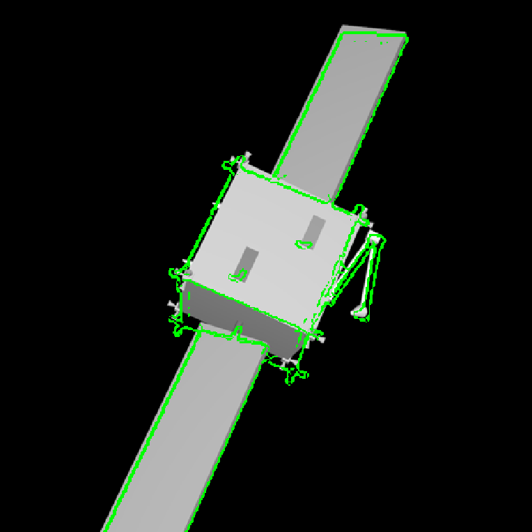
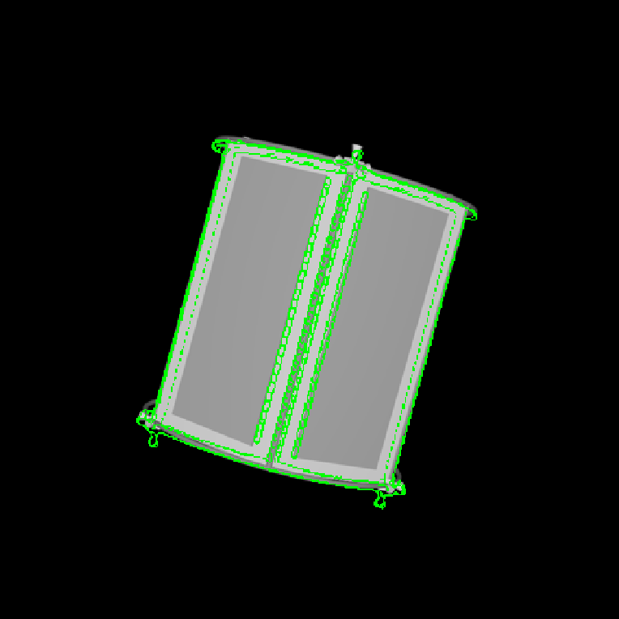

# Image Recongnition and Processing for Navigation

**Summary**: Design, development and verification of the necessary capabilities in image processing for position, pose and angular motion detection on uncooperative targets in an Active Debris Removal scenario.

ESA has identified Active Debris Removal as a strategic goal, as it is necessary to stabilise the growth of space debris. This activity covers the gap for the capabilities needed in image processing using cameras in the visual and Infrared range of the spectrum and LIDAR sensors for precise estimation of position, pose and angular motion on uncooperative targets in an Active Debris Removal scenario. Results had to be computed using only individual sensors and in a combined suite, allowing to identify the pros and cons of each of them, with their specific contributions to the overall performance. Characterization of the infrared sensor was key, as it was the evaluation and analysis of the difficulties and workarounds to test it on-ground. [^1]

Relative chaser-target state estimates are provided by specific image recognition and processing (IRP) algorithms and sensor fusion algorithms in a navigation function (NAV) using sensor data from cameras in the visible spectrum (VIS) and infrared spectrum (IR)) and light detection and ranging (LIDAR) considering as reference mission the Active Debris Removal of ENVISAT (100 … 2 m).

<figure markdown>
  { width="600" }
  <figcaption>Structure of the IRPN system</figcaption>
</figure>

An edge-based pose estimation algorithm is developed for known target satellites as my diploma thesis. The algorithm is base on mono-camera and was evaluated as part of the IPR system.
This system is able to estimate the full 6D pose of the considered target object relative to the camera coordinates. It is assumed that a fixed 3D CAD model is available
for pre-generating synthetic templates.

The target is extracted by means of background subtraction technique. Its edges are extracted with Canny detector and then used for matching a set of previously stored templates to retrieve the pose parameters with use of a monocular camera system. Chamfer Matching and Affinity propagation are modified and applied for this purpose.

<figure markdown>
  { width="600" }
  <figcaption>Principle of the pose estimation algorithm</figcaption>
</figure>

The pose estimation algorithm can probabilistically estimate the full pose based on the result of matching and alignment. The proposed concept can serve as initialization of a frame-by-frame pose tracking. With the help of them, the Rendenzvous maneuver between autonomous approaching Chaser and an uncooperative target comes to be possible.

<figure markdown>
  { width="300" }
</figure>
<figure markdown>
  { width="300" }
</figure>

[^1]: https://www.esa.int/Enabling_Support/Space_Engineering_Technology/Shaping_the_Future/Image_Recognition_and_Processing_for_Navigation_IRPN
